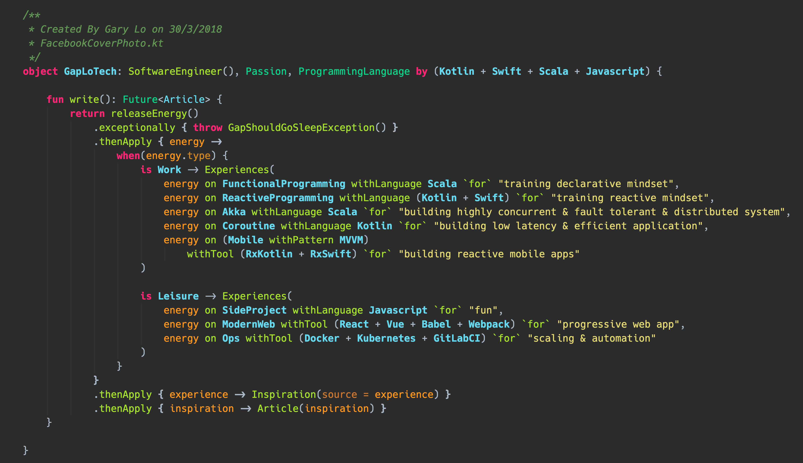

# Bio as Code
> The best way to introduce yourself as a developer to other developers is to use your
favourite programming language to write a short bio that is syntactically and semantically correct. ⎯ GapLoTech

At least we know we are speaking the same language.

rendered with IntelliJ Ultimate, [GapStyle color scheme](https://github.com/gaplo917/GapStyle), [Hack JBM Ligatured CCG Font](https://github.com/gaplo917/Ligatured-Hack)
